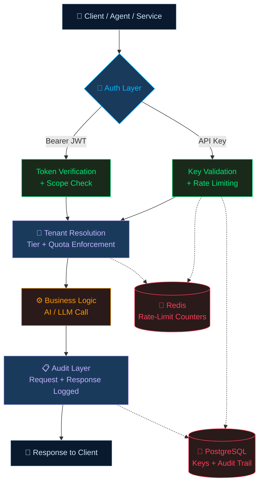
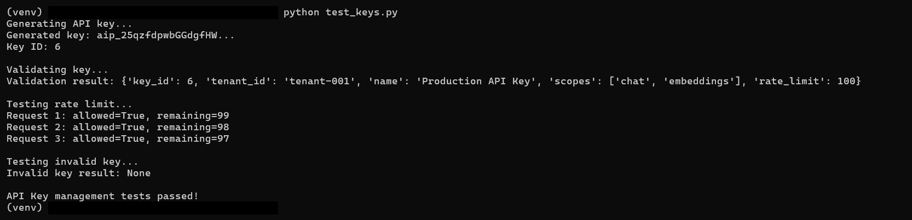
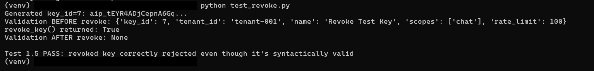
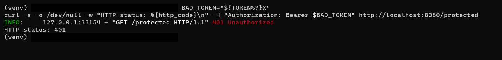
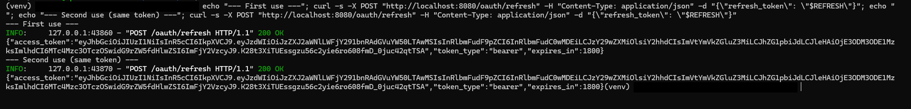
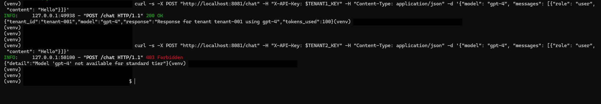
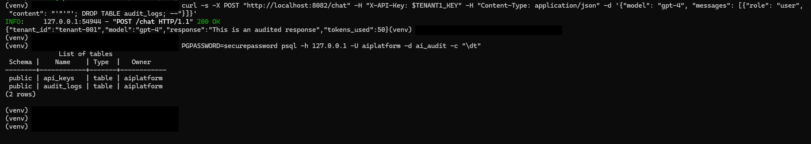

# 🔐 AI Authentication & Authorization — POC Evidence

*A production-pattern security layer for multi-tenant AI/LLM APIs — built, deployed, and adversarially tested end-to-end on live AWS infrastructure*

---

## 📌 What This POC Does

A four-module authentication and authorization layer purpose-built for multi-tenant AI/LLM APIs — hashed API keys with rate limiting, JWT-based OAuth 2.0 service auth, tenant-tiered access control, and compliance-grade audit logging.

> **17 test cases executed on self-provisioned AWS EC2 — not a managed lab environment. 16 passed as designed. 1 surfaced a real, reproducible security gap, documented rather than hidden.**

This repository shares the **architecture, methodology, and real terminal evidence** from the build. Implementation source is kept private; the value here is the security reasoning and the test results themselves.

---

## 🧩 Security Modules

| Module | Solves | Key Mechanism |
|--------|--------|----------------|
| 🔑 **API Key Management** | Who is calling my endpoint? | Hashed keys · Redis-backed rate limiting |
| 🎫 **OAuth 2.0 / JWT** | Service-to-service auth without static passwords | Short-lived access tokens + refresh flow |
| 🏢 **Multi-Tenant Isolation** | Serving many tenants off shared AI infra safely | Tiered quotas · per-tenant model access enforcement |
| 📋 **Audit Logging** | Who did what, when, at what cost? | Compliance-ready, cost/token-trackable request trail |

---

## 🏗️ Architecture (Conceptual)

**Identity is always resolved server-side from the validated key/token — never trusted from client-supplied request fields.** This is why tenant-spoofing fails by construction (see evidence below).

---

## 🛠️ Tech Stack

| Layer | Technology |
|-------|-----------|
| **API Framework** | FastAPI · Uvicorn |
| **Auth** | JWT (python-jose) · bcrypt password hashing |
| **Rate Limiting** | Redis (fixed-window counters) |
| **Persistence** | PostgreSQL |
| **Infrastructure** | AWS EC2 (t3.small, Ubuntu) — self-provisioned, not a managed lab environment |

---

## 🧪 Evidence — Real Terminal Output (Success + Failure)

All screenshots below are captured directly from the live EC2 instance (`palyamiq-abac-sod`, AWS t3.small, Ubuntu). Nothing here is simulated or copied from documentation — every image is a real command run against a running service, across two independent sessions.

### Module 1 — API Key Management

**✅ Key generation, validation, rate limiting, invalid key rejection**

*Key generated and validated with full metadata, rate limit correctly counts down (`99 → 98 → 97`), invalid key correctly returns `None`.*

**❌ Revoked key rejected — even though it's syntactically valid**

*A freshly generated, correctly-hashed key validates successfully before revocation, then is rejected immediately after `revoked=TRUE` is set — proving the revocation check actually holds, not just key format.*

---

### Module 2 — OAuth 2.0 / JWT

**❌ Tampered signature rejected**

*Corrupting the last character of a valid JWT and replaying it returns `401 Unauthorized` — signature verification catches the tamper.*

**⚠️ Confirmed finding — refresh token reuse is NOT blocked**

*The exact same refresh token used twice, back to back — both calls return `200 OK` with a valid access token. No rejection, no rotation. This is the centerpiece finding of this POC: the refresh endpoint verifies token signature and type, but never tracks whether a given refresh token has already been redeemed. A leaked refresh token functions as a standing 7-day credential, not a one-time exchange token.*

---

### Module 3 — Multi-Tenant Isolation

**✅ Enterprise tenant succeeds, ❌ Standard tenant denied — same model, different tiers**

*Tenant-001 (enterprise tier) requests `gpt-4` → `200 OK`. Tenant-002 (standard tier) requests the exact same model → `403 Forbidden`, `"Model 'gpt-4' not available for standard tier"`. Tier enforcement happens at the middleware layer, before any business logic runs.*

---

### Module 4 — Audit Logging

**❌ SQL injection attempt logged as inert text, table integrity confirmed**

*A `'; DROP TABLE audit_logs; --` payload sent as chat message content is stored verbatim as harmless text in the audit log — the request still returns `200 OK`, and a follow-up `\dt` confirms the `audit_logs` table is intact. Parameterized queries throughout the audit pipeline are what make this hold.*

---

## 📊 Test Results Summary

**17/17 tests executed · 16 passed as designed · 1 confirmed finding**

| Module | Success Cases | Failure/Attack Cases | Result |
|--------|:---:|:---:|:---:|
| 🔑 API Key Management | 3/3 | 3/3 | ✅ 6/6 |
| 🎫 OAuth 2.0 / JWT | 3/3 | 2/3 | ⚠️ 5/6 |
| 🏢 Multi-Tenant Isolation | 2/2 | 2/2 | ✅ 4/4 |
| 📋 Audit Logging | 3/3 | 1/1 | ✅ 4/4 |

---

## 🔒 Finding: Refresh Tokens Are Reusable Indefinitely

Testing the OAuth refresh flow with the **same refresh token used three separate times** returned a valid, distinct access token on every call — no rejection, no rotation.

**Root cause:** the refresh mechanism verifies token signature and type, but never records or checks whether a specific refresh token has already been redeemed.

**Impact:** a leaked refresh token functions as a standing 7-day credential, not a one-time exchange token.

**Fix:** track issued refresh tokens (e.g. a keyed denylist/allowlist), invalidate on first use, and treat reuse as a theft signal — rotate-and-invalidate rather than verify-and-reissue.

---

## 🎓 Attribution & Scope

Independent reference implementation exploring authentication/authorization patterns for multi-tenant AI infrastructure. Built as a hands-on capstone informed by the TeKanAid AI Platform Engineering Bootcamp curriculum, deployed and tested entirely on self-provisioned AWS infrastructure (not a managed lab environment). Implementation source is kept private; this repository documents architecture, methodology, and evidence.

---

**[Kasu Mallikarjuna](https://www.linkedin.com/in/mallikarjuna-k-a98a67160)**

*17 tests · 1 real finding · Built on self-provisioned AWS infrastructure*

