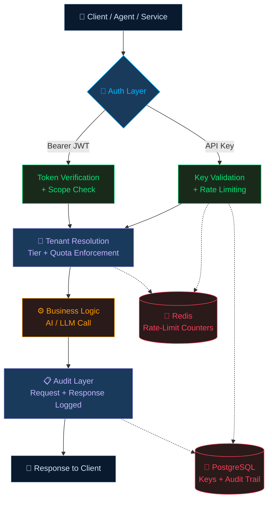

# 🔐 AI Authentication & Authorization — POC Evidence

<div align="center">


*A production-pattern security layer for multi-tenant AI/LLM APIs — built, deployed, and adversarially tested end-to-end on live AWS infrastructure*

</div>

---

## 📌 What This POC Does

A four-module authentication and authorization layer purpose-built for multi-tenant AI/LLM APIs — hashed API keys with rate limiting, JWT-based OAuth 2.0 service auth, tenant-tiered access control, and compliance-grade audit logging.

> **17 test cases executed on self-provisioned AWS EC2 — not a managed lab environment. 16 passed as designed. 1 surfaced a real, reproducible security gap, documented rather than hidden.**

This repository shares the **architecture, methodology, and real terminal evidence** from the build. Implementation source is kept private; the value here is the security reasoning and the test results themselves.

---

## 🧩 Security Modules

| Module | Solves | Key Mechanism |
|--------|--------|----------------|
| 🔑 **API Key Management** | Who is calling my endpoint? | Hashed keys · Redis-backed rate limiting |
| 🎫 **OAuth 2.0 / JWT** | Service-to-service auth without static passwords | Short-lived access tokens + refresh flow |
| 🏢 **Multi-Tenant Isolation** | Serving many tenants off shared AI infra safely | Tiered quotas · per-tenant model access enforcement |
| 📋 **Audit Logging** | Who did what, when, at what cost? | Compliance-ready, cost/token-trackable request trail |

---

## 🏗️ Architecture (Conceptual)



**Identity is always resolved server-side from the validated key/token — never trusted from client-supplied request fields.** This is why tenant-spoofing fails by construction (see evidence below).

---

## 🛠️ Tech Stack

| Layer | Technology |
|-------|-----------|
| **API Framework** | FastAPI · Uvicorn |
| **Auth** | JWT (python-jose) · bcrypt password hashing |
| **Rate Limiting** | Redis (fixed-window counters) |
| **Persistence** | PostgreSQL |
| **Infrastructure** | AWS EC2 (t3.small, Ubuntu) — self-provisioned, not a managed lab environment |

---

## 🧪 Evidence — Real Terminal Output (Success + Failure)

All output below is captured directly from the live EC2 instance. Nothing here is simulated or copied from documentation — every block is a real command run against a running service.

### Module 1 — API Key Management

**✅ Success — key generated and validated**
```
$ python src/test_keys.py
Generating API key...
Generated key: aip_KrTzQ7mXvEibvX6l...
Key ID: 1
Validating key...
Validation result: {'key_id': 1, 'tenant_id': 'tenant-001', 'name': 'Production API Key', 'scopes': ['chat', 'embeddings'], 'rate_limit': 100}
```

**✅ Success — rate limit counts down correctly**
```
Testing rate limit...
Request 1: allowed=True, remaining=99
Request 2: allowed=True, remaining=98
Request 3: allowed=True, remaining=97
```

**❌ Failure (expected) — invalid key rejected**
```
Testing invalid key...
Invalid key result: None
```

**❌ Failure (expected) — revoked key rejected even though it's syntactically valid**
```
$ python test_revoke.py
Validation BEFORE revoke: {'key_id': 2, 'tenant_id': 'tenant-001', 'name': 'Revoke Test Key', ...}
revoke_key() returned: True
Validation AFTER revoke: None
Test 1.5 PASS: revoked key correctly rejected even though it's syntactically valid
```

**❌ Failure (expected) — rate limit blocks at the ceiling**
```
$ for i in $(seq 1 15); do ... done
Request 1: HTTP 200
Request 2: HTTP 200
...
Request 10: HTTP 200
Request 11: HTTP 429
Request 12: HTTP 429
Request 13: HTTP 429
Request 14: HTTP 429
Request 15: HTTP 429
```

---

### Module 2 — OAuth 2.0 / JWT

**✅ Success — token issued**
```
$ curl -X POST "http://localhost:8080/oauth/token" \
  -d "username=service-account@tenant-001&password=secret123"

{"access_token":"eyJhbGciOiJIUzI1NiIs...","refresh_token":"eyJhbGciOiJIUzI1NiIs...","token_type":"bearer","expires_in":1800}
```

**✅ Success — protected endpoint grants access, and refresh preserves original scopes**
```
$ curl -H "Authorization: Bearer $TOKEN" http://localhost:8080/protected
{"message":"Access granted","user":{"user_id":"service-account@tenant-001","tenant_id":"tenant-001","scopes":["chat","embeddings","admin"]}}

$ curl -H "Authorization: Bearer $NEW_TOKEN" http://localhost:8080/protected
{"message":"Access granted","user":{"user_id":"service-account@tenant-001","tenant_id":"tenant-001","scopes":["chat","embeddings","admin"]}}
```
*Identical scopes on original and refreshed token — refresh does not grant elevated access.*

**❌ Failure (expected) — tampered signature rejected**
```
$ curl -H "Authorization: Bearer $BAD_TOKEN" http://localhost:8080/protected
HTTP status: 401
```

**❌ Failure (expected) — access token rejected when used as a refresh token**
```
$ curl -X POST "http://localhost:8080/oauth/refresh" -d '{"refresh_token": "'"$TOKEN"'"}'
{"detail":"Invalid refresh token"}
```

**⚠️ Confirmed finding — refresh token reuse is NOT blocked**
```
--- First use of REFRESH ---
{"access_token":"eyJhbGciOiJIUzI1NiIs...Cd66-WmjjdK0uGd9Hx1q1CF4l...","token_type":"bearer","expires_in":1800}

--- Second use of the SAME REFRESH token ---
{"access_token":"eyJhbGciOiJIUzI1NiIs...Cd66-WmjjdK0uGd9Hx1q1CF4l...","token_type":"bearer","expires_in":1800}
```
*Both calls returned `200` with a valid new access token. Confirmed a third time via manual retry — same result. No rejection, no rotation.*

---

### Module 3 — Multi-Tenant Isolation

**✅ Success — enterprise tenant accesses gpt-4**
```
$ curl -X POST "http://localhost:8081/chat" -H "X-API-Key: $TENANT1_KEY" \
  -d '{"model": "gpt-4", "messages": [...]}'

{
    "tenant_id": "tenant-001",
    "model": "gpt-4",
    "response": "Response for tenant tenant-001 using gpt-4",
    "tokens_used": 100
}
```

**❌ Failure (expected) — standard tenant denied gpt-4**
```
$ curl -X POST "http://localhost:8081/chat" -H "X-API-Key: $TENANT2_KEY" \
  -d '{"model": "gpt-4", "messages": [...]}'

{
    "detail": "Model 'gpt-4' not available for standard tier"
}
```

**✅ Success — tenant quota info accurate**
```
$ curl -H "X-API-Key: $TENANT1_KEY" "http://localhost:8081/tenant/info"
{
    "tenant_id": "tenant-001",
    "name": "Acme Corp",
    "tier": "enterprise",
    "quotas": {"requests_per_minute": 1000, "max_tokens_per_request": 8192, "max_context_length": 32000},
    "allowed_models": ["gpt-4", "gpt-3.5-turbo", "claude-3-opus"],
    "data_region": "us-east-1"
}
```

**❌ Failure (expected — attack attempt) — spoofed tenant_id in request body is ignored**
```
$ curl -X POST "http://localhost:8081/chat" -H "X-API-Key: $TENANT2_KEY" \
  -d '{"model": "gpt-3.5-turbo", "tenant_id": "tenant-001", "messages": [...]}'

{
    "tenant_id": "tenant-002",
    "model": "gpt-3.5-turbo",
    "response": "Response for tenant tenant-002 using gpt-3.5-turbo",
    "tokens_used": 100
}
```
*Note: response correctly shows `tenant-002` despite the request body attempting to claim `tenant-001` — identity resolved server-side only.*

---

### Module 4 — Audit Logging

**✅ Success — usage summary aggregates correctly**
```
$ curl -H "X-API-Key: $TENANT1_KEY" "http://localhost:8082/audit/summary"
{
    "total_requests": 5,
    "active_days": 1,
    "avg_response_time_ms": 42.4,
    "error_count": 0,
    "total_tokens": 500
}
```

**❌ Failure (expected — attack attempt) — SQL injection logged as inert text, table survives**
```
$ curl -X POST "http://localhost:8082/chat" -H "X-API-Key: $TENANT1_KEY" \
  -d '{"model": "gpt-4", "messages": [{"role": "user", "content": "'\''; DROP TABLE audit_logs; --"}]}'

{"tenant_id":"tenant-001","model":"gpt-4","response":"This is an audited response","tokens_used":50}

$ psql -c "\dt"
              List of tables
 Schema |    Name    | Type  |   Owner
--------+------------+-------+------------
 public | api_keys   | table | aiplatform
 public | audit_logs | table | aiplatform
(2 rows)

$ psql -c "SELECT COUNT(*) FROM audit_logs;"
 count
-------
     6
(1 row)
```
*The injection payload was stored verbatim as harmless text in the logged request body — table intact, count correct, nothing executed.*

---

## 📊 Test Results Summary

**17/17 tests executed · 16 passed as designed · 1 confirmed finding**

| Module | Success Cases | Failure/Attack Cases | Result |
|--------|:---:|:---:|:---:|
| 🔑 API Key Management | 3/3 | 3/3 | ✅ 6/6 |
| 🎫 OAuth 2.0 / JWT | 3/3 | 2/3 | ⚠️ 5/6 |
| 🏢 Multi-Tenant Isolation | 2/2 | 2/2 | ✅ 4/4 |
| 📋 Audit Logging | 3/3 | 1/1 | ✅ 4/4 |

---

## 🔒 Finding: Refresh Tokens Are Reusable Indefinitely

Testing the OAuth refresh flow with the **same refresh token used three separate times** returned a valid, distinct access token on every call — no rejection, no rotation.

**Root cause:** the refresh mechanism verifies token signature and type, but never records or checks whether a specific refresh token has already been redeemed.

**Impact:** a leaked refresh token functions as a standing 7-day credential, not a one-time exchange token.

**Fix:** track issued refresh tokens (e.g. a keyed denylist/allowlist), invalidate on first use, and treat reuse as a theft signal — rotate-and-invalidate rather than verify-and-reissue.

---

## 🎓 Attribution & Scope

Independent reference implementation exploring authentication/authorization patterns for multi-tenant AI infrastructure. Built as a hands-on capstone informed by the TeKanAid AI Platform Engineering Bootcamp curriculum, deployed and tested entirely on self-provisioned AWS infrastructure (not a managed lab environment). Implementation source is kept private; this repository documents architecture, methodology, and evidence.

---

<div align="center">

**[Kasu Mallikarjuna](https://www.linkedin.com/in/mallikarjuna-k-a98a67160)**

[](https://www.linkedin.com/in/mallikarjuna-k-a98a67160)
[](https://palyamiq.com)

*17 tests · 1 real finding · Built on self-provisioned AWS infrastructure*

</div>
